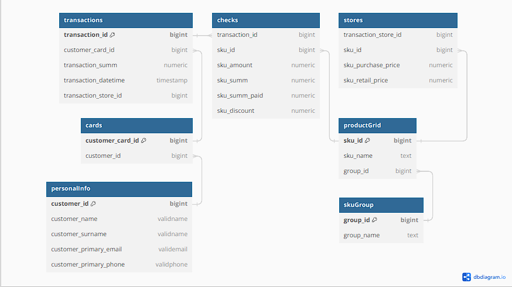
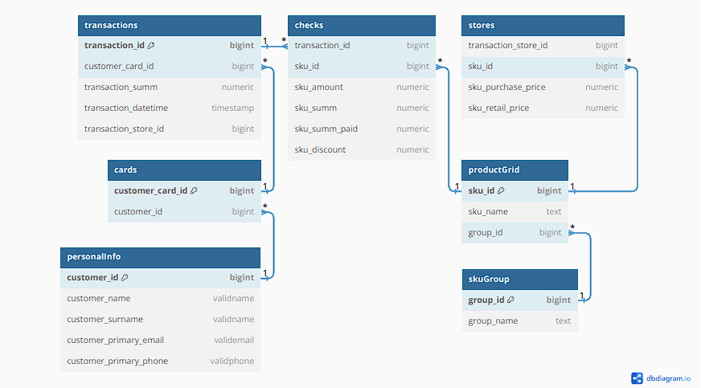

# RetailAnalytics 

Загрузка данных по аналитике розничных сетей, их анализ, статистика, сегментация клиентов и создание персональных предложений.

## Introduction

В данном проекте создается база данных сети магазинов на Postgresql.
Yужно создать базу данных со знаниями о клиентах розничных сетей, а также написать представления и процедуры, необходимые для создания персональных предложений.

## Диаграмма проекта

## Запуск проекта

Проект может быть развернут с помощью docker с автоматической загрузкой всех данных.

* sudo docker build -t my_postgres_image .
* sudo docker run --rm --name my_postgres -p 5431:5432 -v "$(pwd)":/var/lib/postgresql/data -e POSTGRES_PASSWORD=postgres my_postgres_image

* Если первый run не сработал, можно попробовать так:
    + sudo docker run --rm --name my_postgres -p 5431:5432 -e POSTGRES_PASSWORD=postgres my_postgres_image

* В src/miscelaneous/debug.sql есть полезные функции, если вы решили все запускать вручнуюю

## Logical view of database model

Данные, описанные в таблицах из раздела [Входные данные](#входные-данные) заполняются пользователем.

Данные, описанные в представлениях из раздела [Выходные данные](#выходные-данные) вычисляются программно.

### Входные данные

#### Таблица Персональные данные

| **Поле**                    | **Название поля в системе** | **Формат / возможные значения**                                                  | **Описание** |
|:---------------------------:|:---------------------------:|:--------------------------------------------------------------------------------:|:------------:|
| Идентификатор клиента       | Customer_ID                 | ---                                                                              | ---          |
| Имя                         | Customer_Name               | Кириллица или латиница, первая буква заглавная, остальные прописные, допустимы тире и пробелы | ---          |
| Фамилия                     | Customer_Surname            | Кириллица или латиница, первая буква заглавная, остальные прописные, допустимы тире и пробелы | ---          |
| E-mail клиента              | Customer_Primary_Email      | Формат E-mail                                                                    | ---          |
| Телефон клиента             | Customer_Primary_Phone      | +7 и 10 арабских цифр                                                                 | ---          |

#### Таблица Карты

| **Поле**              | **Название поля в системе** | **Формат / возможные значения** | **Описание**                                     |
|:---------------------:|:---------------------------:|:-------------------------------:|:------------------------------------------------:|
| Идентификатор карты   | Customer_Card_ID            | ---                             | ---                                              |
| Идентификатор клиента | Customer_ID                 | ---                             | Одному клиенту может принадлежать несколько карт |

#### Таблица Транзакции

| **Поле**                 | **Название поля в системе** | **Формат / возможные значения** | **Описание**                                                          |
|:------------------------:|:---------------------------:|:-------------------------------:|:---------------------------------------------------------------------:|
| Идентификатор транзакции | Transaction_ID              | ---                             | Уникальное значение                                                   |
| Идентификатор карты      | Customer_Card_ID            | ---                             | ---                                                                   |
| Сумма транзакции         | Transaction_Summ            | Арабская цифра                  | Сумма транзакции в рублях (полная стоимость покупки без учета скидок) |
| Дата транзакции          | Transaction_DateTime        | дд.мм.гггг чч:мм:сс             | Дата и время совершения транзакции                                    |
| Торговая точка           | Transaction_Store_ID        | Идентификатор магазина          | Магазин, в котором была совершена транзакция                          |

#### Таблица Чеки

| **Поле**                            | **Название поля в системе** | **Формат / возможные значения** | **Описание**                                                                                            |
|:-----------------------------------:|:---------------------------:|:-------------------------------:|:-------------------------------------------------------------------------------------------------------:|
| Идентификатор транзакции            | Transaction_ID              | ---                             | Идентификатор транзакции указывается для всех позиций в чеке                                            |
| Позиция в чеке                      | SKU_ID                      | ---                             | ---                                                                                                     |
| Количество штук или килограмм       | SKU_Amount                  | Арабская цифра                  | Указание, какое количество товара было куплено                                                          |
| Сумма, на которую был куплен товар  | SKU_Summ                    | Арабская цифра                  | Сумма покупки фактического объема данного товара в рублях (полная стоимость без учета скидок и бонусов) |
| Оплаченная стоимость покупки товара | SKU_Summ_Paid               | Арабская цифра                  | Фактически оплаченная сумма покупки данного товара, не включая сумму предоставленной скидки             |
| Предоставленная скидка              | SKU_Discount                | Арабская цифра                  | Размер предоставленной на товар скидки в рублях                                                         |

#### Таблица Товарная матрица

| **Поле**                    | **Название поля в системе** | **Формат / возможные значения**        | **Описание**                                                                                                                                                                                                 |
|:---------------------------:|:---------------------------:|:--------------------------------------:|:------------------------------------------------------------------------------------------------------------------------------------------------------------------------------------------------------------:|
| Идентификатор товара        | SKU_ID                      | ---                                    | ---                                                                                                                                                                                                          |
| Название товара             | SKU_Name                    | Кириллица или латиница, арабские цифры, спецсимволы | ---                                                                                                                                                                                                          |
| Группа SKU                  | Group_ID                    | ---                                    | Идентификатор группы родственных товаров, к которой относится товар (например, одинаковые йогурты одного производителя и объема, но разных вкусов). Указывается один идентификатор для всех товаров в группе |

#### Таблица Торговые точки

| **Поле**                    | **Название поля в системе** | **Формат / возможные значения** | **Описание**                                                   |
|:---------------------------:|:---------------------------:|:-------------------------------:|:--------------------------------------------------------------:|
| Торговая точка              | Transaction_Store_ID        | ---                             | ---                                                            |
| Идентификатор товара        | SKU_ID                      | ---                             | ---                                                            |
| Закупочная стоимость товара | SKU_Purchase_Price          | Арабская цифра                  | Закупочная стоимость товара для данного магазина               |
| Розничная стоимость товара  | SKU_Retail_Price            | Арабская цифра                  | Стоимость продажи товара без учета скидок для данного магазина |

#### Таблица Группы SKU

| **Поле**                    | **Название поля в системе** | **Формат / возможные значения**        | **Описание** |
|:---------------------------:|:---------------------------:|:--------------------------------------:|:------------:|
| Группа SKU                  | Group_ID                    | ---                                    | ---          |
| Название группы             | Group_Name                  | Кириллица или латиница, арабские цифры, спецсимволы | ---          |

#### Таблица Дата формирования анализа

| **Поле**                    | **Название поля в системе** | **Формат / возможные значения**        | **Описание** |
|:---------------------------:|:---------------------------:|:--------------------------------------:|:------------:|
| Дата формирования анализа                  | Analysis_Formation                    | дд.мм.гггг чч:мм:сс                                    | ---          |

### Выходные данные

#### Представление Клиенты

| **Поле**                                    | **Название поля в системе**    | **Формат / возможные значения**  | **Описание**                                                                  |
|:-------------------------------------------:|:------------------------------:|:--------------------------------:|:-----------------------------------------------------------------------------:|
| Идентификатор клиента                       | Customer_ID                    | ---                              | Уникальное значение                                                           |
| Значение среднего чека                      | Customer_Average_Check         | Арабская цифра, десятичная дробь | Значение среднего чека клиента в рублях за анализируемый период               |
| Сегмент по среднему чеку                    | Customer_Average_Check_Segment | Высокий; Средний; Низкий         | Описание сегмента                                                             |
| Значение частоты транзакций                 | Customer_Frequency             | Арабская цифра, десятичная дробь | Значение частоты визитов клиента в среднем количестве дней между транзакциями |
| Сегмент по частоте транзакций               | Customer_Frequency_Segment     | Часто; Средне; Редко             | Описание сегмента                                                             |
| Количество дней после предыдущей транзакции | Customer_Inactive_Period       | Арабская цифра, десятичная дробь | Количество дней, прошедших с даты предыдущей транзакции клиента               |
| Коэффициент оттока                          | Customer_Churn_Rate            | Арабская цифра, десятичная дробь | Значение коэффициента оттока клиента                                          |
| Сегмент по коэффициенту оттока              | Customer_Churn_Segment         | Высокий; Средний; Низкий         | Описание сегмента                                                             |
| Номер сегмента                              | Customer_Segment               | Арабская цифра                   | Номер сегмента, к которому принадлежит клиент                                 |
| Идентификатор основного магазина            | Customer_Primary_Store         | ---                              | ---                                                                           |

#### Представление История покупок

| **Поле**                        | **Название поля в системе** | **Формат / возможные значения**  | **Описание**                                                                                                                                                                                                 |
|:-------------------------------:|:---------------------------:|:--------------------------------:|:------------------------------------------------------------------------------------------------------------------------------------------------------------------------------------------------------------:|
| Идентификатор клиента           | Customer_ID                 | ---                              | ---                                                                                                                                                                                                          |
| Идентификатор транзакции        | Transaction_ID              | ---                              | ---                                                                                                                                                                                                          |
| Дата транзакции                 | Transaction_DateTime        | гггг-мм-ддTчч:мм:сс.0000000      | Дата совершения транзакции                                                                                                                                                                                   |
| Группа SKU                      | Group_ID                    | ---                              | Идентификатор группы родственных товаров, к которой относится товар (например, одинаковые йогурты одного производителя и объема, но разных вкусов). Указывается один идентификатор для всех товаров в группе |
| Себестоимость                   | Group_Cost                  | Арабская цифра, десятичная дробь | ---                                                                                                                                                                                                          |
| Базовая розничная стоимость     | Group_Summ                  | Арабская цифра, десятичная дробь | ---                                                                                                                                                                                                          |
| Фактически оплаченная стоимость | Group_Summ_Paid             | Арабская цифра, десятичная дробь | ---                                                                                                                                                                                                          |

#### Представление Периоды

| **Поле**                            | **Название поля в системе** | **Формат / возможные значения**  | **Описание**                                                                                                                                                                                                 |
|:-----------------------------------:|:---------------------------:|:--------------------------------:|:------------------------------------------------------------------------------------------------------------------------------------------------------------------------------------------------------------:|
| Идентификатор клиента               | Customer_ID                 | ---                              | ---                                                                                                                                                                                                          |
| Идентификатор группы SKU            | Group_ID                    | ---                              | Идентификатор группы родственных товаров, к которой относится товар (например, одинаковые йогурты одного производителя и объема, но разных вкусов). Указывается один идентификатор для всех товаров в группе |
| Дата первой покупки группы          | First_Group_Purchase_Date   | гггг-мм-ддTчч:мм:сс.0000000      | ---                                                                                                                                                                                                          |
| Дата последней покупки группы       | Last_Group_Purchase_Date    | гггг-мм-ддTчч:мм:сс.0000000      | ---                                                                                                                                                                                                          |
| Количество транзакций с группой     | Group_Purchase              | Арабская цифра, десятичная дробь | ---                                                                                                                                                                                                          |
| Интенсивность покупок группы        | Group_Frequency             | Арабская цифра, десятичная дробь | ---                                                                                                                                                                                                          |
| Минимальный размер скидки по группе | Group_Min_Discount          | Арабская цифра, десятичная дробь | ---                                                                                                                                                                                                          |

#### Представление Группы

| **Поле**                   | **Название поля в системе** | **Формат / возможные значения**  | **Описание**                                                                                                                        |
|:--------------------------:|:---------------------------:|:--------------------------------:|:-----------------------------------------------------------------------------------------------------------------------------------:|
| Идентификатор клиента      | Customer_ID                 | ---                              | ---                                                                                                                                 |
| Идентификатор группы       | Group_ID                    | ---                              | ---                                                                                                                                 |
| Индекс востребованности    | Group_Affinity_Index        | Арабская цифра, десятичная дробь | Коэффициент востребованности данной группы клиентом                                                                                 |
| Индекс оттока              | Group_Churn_Rate            | Арабская цифра, десятичная дробь | Индекс оттока клиента по конкретной группе                                                                                          |
| Индекс стабильности        | Group_Stability_Index       | Арабская цифра, десятичная дробь | Показатель, демонстрирующий стабильность потребления группы клиентом                                                                |
| Актуальная маржа по группе | Group_Margin                | Арабская цифра, десятичная дробь | Показатель актуальной маржи по группе для конкретного клиента                                                                       |
| Доля транзакций со скидкой | Group_Discount_Share        | Арабская цифра, десятичная дробь | Доля транзакций по покупке группы клиентом, в рамках которых были применена скидка (без учета списания бонусов программы лояльности) |
| Минимальный размер скидки  | Group_Minimum_Discount      | Арабская цифра, десятичная дробь | Минимальный размер скидки, зафиксированный для клиента по группе                                                                    |
| Средний размер скидки      | Group_Average_Discount      | Арабская цифра, десятичная дробь | Средний размер скидки по группе для клиента                                                                                         |

## Создание базы данных

Cкрипт *part1.sql*, создаст базу данных и таблицы, описанные выше в разделе [входные данные](#входные-данные).

Скрипт также содержит процедуры, позволяющие импортировать и экспортировать данные для каждой таблицы из файлов/в файлы с расширением *.csv* и *.tsv*. \
В качестве параметра каждой процедуры для импорта из *csv* файла указывается разделитель.

Тестовые данные могут быть найдены в папке *datasets*.

## Создание представлений

Скрипт *part2.sql*, содержит представления, описанные выше в разделе [выходные данные](#выходные-данные).

## Ролевая модель

Скрипт *part3.sql* создает роли и выдает им права в соответствии с описанным ниже.

####  Администратор
Администратор имеет полные права на редактирование и просмотр
любой информации, запуск и остановку процесса обработки.

####  Посетитель
Только просмотр информации из всех таблиц.

## Формирование персональных предложений, ориентированных на рост среднего чека

Скрипт *part4.sql*, содержит такую функцию:

Параметры функции:
- метод расчета среднего чека (1 - за период, 2 - за количество)
- первая и последняя даты периода (для 1 метода)
- количество транзакций (для 2 метода)
- коэффициент увеличения среднего чека
- максимальный индекс оттока
- максимальная доля транзакций со скидкой (в процентах)
- допустимая доля маржи (в процентах)

Вывод функции:

| **Поле**                       | **Название поля в системе** | **Формат / возможные значения**            | **Описание**                                                                               |
|--------------------------------|-----------------------------|--------------------------------------------|--------------------------------------------------------------------------------------------|
| Идентификатор клиента          | Customer_ID                 |                                            |                                                                                            |
| Целевое значение среднего чека | Required_Check_Measure      | Арабская цифра (десятичная дробь)          | Целевое значение среднего чека, необходимое для получения вознаграждения                   |
| Группа предложения             | Group_Name                  |                                            | Название группы предложения, на которой начисляется вознаграждение при выполнении условия. |
| Максимальная глубина скидки    | Offer_Discount_Depth        | Арабская цифра (десятичная дробь), процент | Максимально возможный размер скидки для предложения                                        |

## Формирование персональных предложений, ориентированных на рост частоты визитов

Cкрипт *part5.sql*, содержит такую функцию:

Параметры функции:
- первая и последняя даты периода
- добавляемое число транзакций
- максимальный индекс оттока
- максимальная доля транзакций со скидкой (в процентах)
- допустимая доля маржи (в процентах)

Вывод функции:

| **Поле**                      | **Название поля в системе** | **Формат / возможные значения**            | **Описание**                                                                               |
|-------------------------------|-----------------------------|--------------------------------------------|--------------------------------------------------------------------------------------------|
| Идентификатор клиента         | Customer_ID                 |                                            |                                                                                            |
| Дата начала периода           | Start_Date                  | гггг-мм-ддTчч:мм:сс.0000000                | Дата начала периода, в течение которого необходимо совершить транзакции                    |
| Дата окончания периода        | End_Date                    | гггг-мм-ддTчч:мм:сс.0000000                | Дата окончания периода, в течение которого необходимо совершить транзакции                 |
| Целевое количество транзакций | Required_Transactions_Count | Арабская цифра (десятичная дробь)          | Порядковый номер транзакции, на которую начисляется вознаграждение                         |
| Группа предложения            | Group_Name                  |                                            | Название группы предложения, на которой начисляется вознаграждение при выполнении условия. |
| Максимальная глубина скидки   | Offer_Discount_Depth        | Арабская цифра (десятичная дробь), процент | Максимально возможный размер скидки для предложения                                        |

## Формирование персональных предложений, ориентированных на кросс-продажи

Cкрипт *part6.sql*, содержит такую функцию:

Параметры функции:
- количество групп
- максимальный индекс оттока
- максимальный индекс стабильности потребления
- максимальная доля SKU (в процентах)
- допустимая доля маржи (в процентах)

Предложения, ориентированные на рост маржи за счет кросс-продаж,
подразумевают переключение клиента на максимально маржинальное SKU в
рамках востребованной им группы.

Вывод функции:

| **Поле**                    | **Название поля в системе** | **Формат / возможные значения**            | **Описание**                                                                            |
|-----------------------------|-----------------------------|--------------------------------------------|-----------------------------------------------------------------------------------------|
| Идентификатор клиента       | Customer_ID                 |                                            |                                                                                         |
| SKU предложения             | SKU_Name                    |                                            | Название SKU предложения, на который начисляется вознаграждение при выполнении условия. |
| Максимальная глубина скидки | Offer_Discount_Depth        | Арабская цифра (десятичная дробь), процент | Максимально возможный размер скидки для предложения                                     |